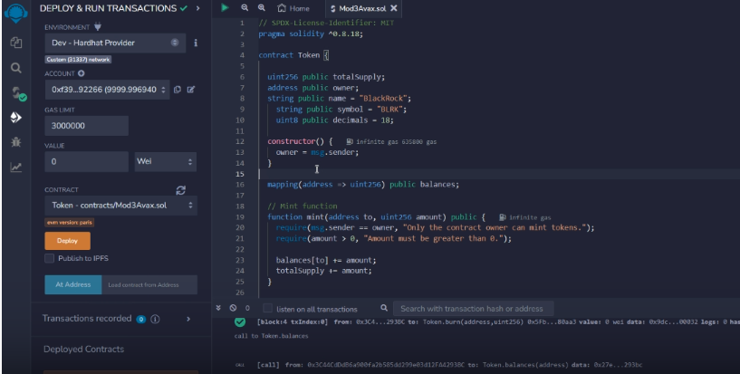
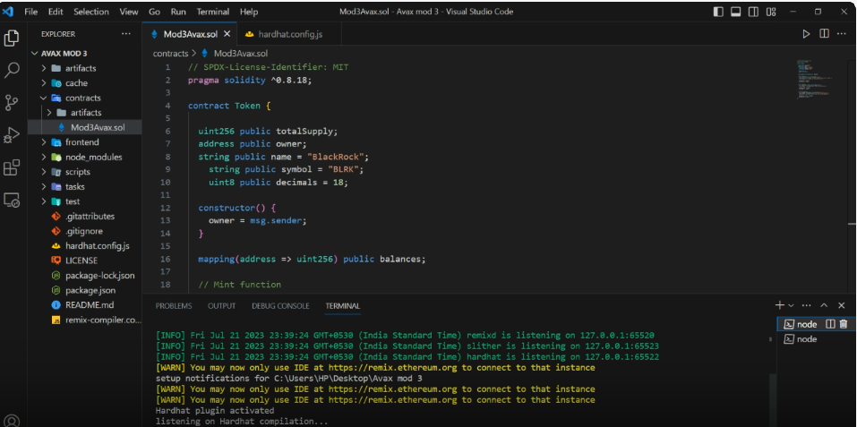

# ERC20 Fungible Token

This Solidity program demonstrates the creation of a "fungible token" using the ERC20 standard. The ERC20 contract is extended and utilized to create customized fungible tokens in the Solidity programming language. The purpose of this program is to showcase how fungible tokens are created in Ethereum Virtual Machines (EVM).

## Description

This program is a simple smart contract written in Solidity, the language used for developing smart contracts on the Ethereum blockchain. The contract includes multiple functions to interact with the fungible token. Key functionalities include minting tokens (which can only be called by the owner), transferring tokens, and approving token transactions.

## Getting Started

### Prerequisites

To run this program, you can use Remix, an online Solidity Integrated Development Environment (IDE). If you haven't used Remix before, you can access it [here](https://remix.ethereum.org/).

### Execution

1. On the Remix website, create a new file with a .sol extension (e.g., Token.sol).
2. Copy and paste the provided Solidity code into the file.
3. Compile the code using the "Solidity Compiler" tab, ensuring the compiler version is set to "0.8.9" or another compatible version.
4. Deploy the contract using the "Deploy & Run Transactions" tab, selecting the "Token" contract from the dropdown menu.
5. Once deployed, interact with the contract by calling its functions through the Remix interface.

## Proof

## Authors

- Avanish Yadav[awanishyadav967]

## License

This project is licensed under the MIT License - see the [LICENSE.md](LICENSE.md) file for details.

